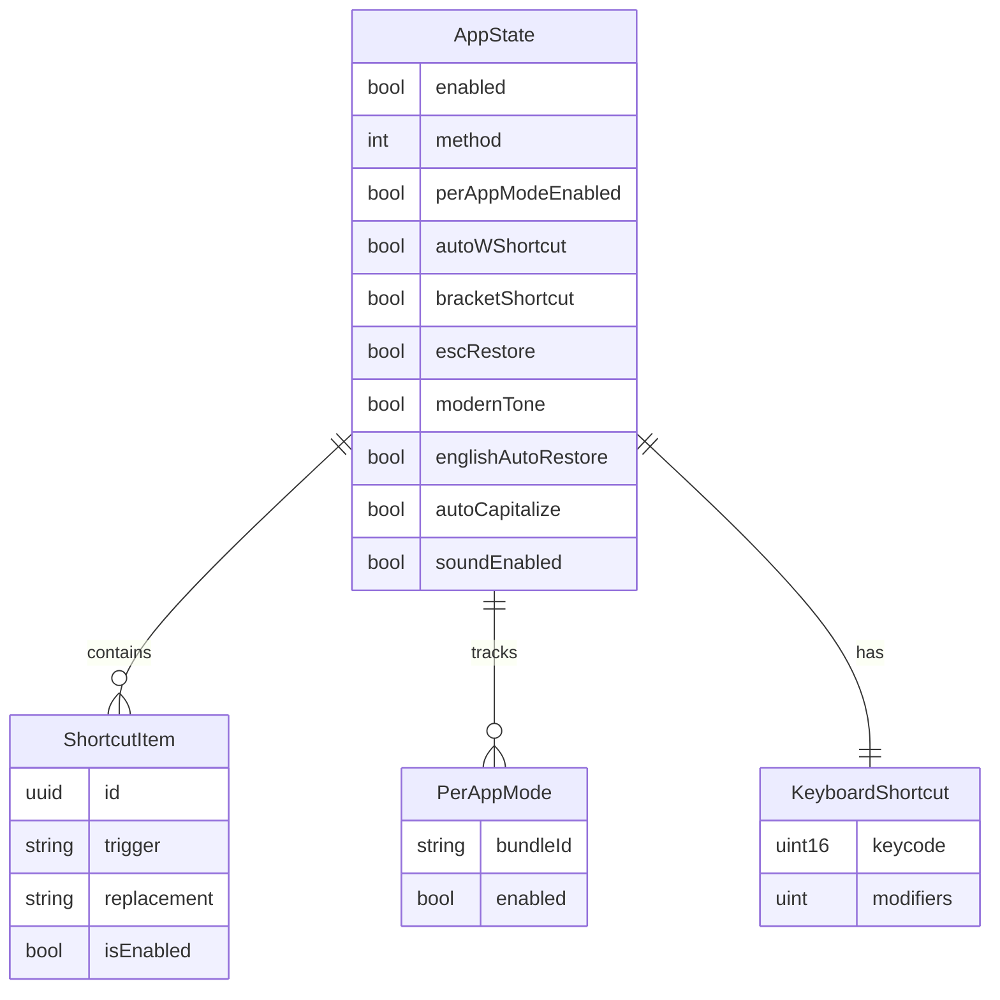

# Data Design (Persistence Layer)

> ⚠️ **Note:** This application has NO traditional database (SQL/NoSQL). This document describes **local data persistence** via macOS UserDefaults and file system.
>
> Auto-generated from codebase on 2026-01-12

---

## 1. Overview

### 1.1 Storage Technologies

| Type | Technology | Scope | Purpose |
|------|------------|-------|---------|
| **Settings** | macOS UserDefaults | User preferences | Key-value storage |
| **Engine State** | Rust memory (static) | Runtime state | Input buffer, shortcuts |
| **Shortcuts** | UserDefaults (JSON) | User data | Text expansion rules |
| **Update Cache** | Memory | Session | Update check results |
| **Per-App Modes** | UserDefaults (Dict) | User preferences | App-specific on/off states |

---

## 2. UserDefaults Schema

### 2.1 Settings Keys

**Source:** `platforms/macos/MainSettingsView.swift:SettingsKey`

| Key | Type | Default | Description |
|-----|------|---------|-------------|
| `enabled` | Bool | `true` | Vietnamese mode on/off |
| `method` | Int | `0` | Input method (0=Telex, 1=VNI) |
| `perAppMode` | Bool | `true` | Enable per-app mode tracking |
| `autoWShortcut` | Bool | `true` | Enable w→ư at word start (Telex) |
| `bracketShortcut` | Bool | `false` | Enable ]→ư, [→ơ (Telex) |
| `escRestore` | Bool | `false` | Enable ESC key restore |
| `modernTone` | Bool | `true` | Modern tone placement (hoà vs hòa) |
| `englishAutoRestore` | Bool | `false` | Enable English auto-restore |
| `autoCapitalize` | Bool | `false` | Auto-capitalize after punctuation |
| `soundEnabled` | Bool | `false` | Play sound on toggle |
| `shortcuts` | Data (JSON) | `[]` | Shortcut array (encoded ShortcutItem[]) |
| `perAppModes` | Dict | `{}` | Per-app on/off states (bundleId → Bool) |
| `hasCompletedOnboarding` | Bool | `false` | Onboarding flow completed |
| `launchAtLoginUserDisabled` | Bool | `false` | User explicitly disabled launch at login |

---

### 2.2 Keyboard Shortcut Storage

**Source:** `platforms/macos/KeyboardShortcut.swift` (inferred)

| Key | Type | Default | Description |
|-----|------|---------|-------------|
| `toggleShortcut.keycode` | Int | (⌥Space) | Virtual keycode |
| `toggleShortcut.modifiers` | UInt | - | Modifier flags (⌥, ⌘, ⌃, ⇧) |

**Storage:** Custom encoding via `KeyboardShortcut.save()` / `.load()`

---

## 3. Data Models

### 3.1 ShortcutItem (User Shortcuts)

**Source:** `MainSettingsView.swift:379-384`

```swift
struct ShortcutItem: Identifiable, Codable {
    var id: UUID              // Unique identifier
    var key: String           // Trigger (e.g., "vn")
    var value: String         // Replacement (e.g., "Việt Nam")
    var isEnabled: Bool       // Active/inactive state
}
```

**Storage:**
- Serialized to JSON
- Stored in UserDefaults under `shortcuts` key
- Synced to Rust engine on change (via FFI `ime_add_shortcut`)

**Example Data:**
```json
[
  {
    "id": "uuid-1",
    "key": "vn",
    "value": "Việt Nam",
    "isEnabled": true
  },
  {
    "id": "uuid-2",
    "key": "hn",
    "value": "Hà Nội",
    "isEnabled": false
  }
]
```

---

### 3.2 Per-App Modes

**Source:** `MainSettingsView.swift:300-312`

**Data Structure:**
```swift
[String: Bool]  // BundleId → Enabled
```

**Example:**
```json
{
  "com.microsoft.VSCode": false,
  "com.tinyspeck.slackmacgap": true,
  "com.google.Chrome": true
}
```

**Behavior:**
- Key exists with `false` → Vietnamese disabled for this app
- Key missing → Vietnamese enabled (default)
- Empty dict → All apps enabled

---

### 3.3 KeyboardShortcut

**Source:** `platforms/macos/KeyboardShortcut.swift` (inferred)

```swift
struct KeyboardShortcut {
    var keycode: UInt16         // macOS virtual keycode
    var modifiers: UInt          // NSEvent.ModifierFlags
    var displayParts: [String]  // ["⌥", "Space"]
}
```

**Default:** ⌥ (Option) + Space

**Storage:** UserDefaults (custom serialization)

---

## 4. Rust Engine State (In-Memory)

### 4.1 Engine Struct

**Source:** `core/src/engine/mod.rs` (inferred)

```rust
struct Engine {
    buffer: CircularBuffer,           // Input buffer (16 chars)
    shortcuts: ShortcutManager,        // Text expansion rules
    enabled: bool,                     // On/off state
    method: InputMethod,               // Telex/VNI
    config: EngineConfig,              // Feature flags
    word_history: Option<WordState>,  // Previous word for restore
}
```

**Lifetime:** Process lifetime (static global with Mutex)

**Persistence:** None (resets on app restart)

---

### 4.2 CircularBuffer

**Source:** `core/src/engine/buffer.rs`

```rust
struct CircularBuffer {
    chars: [char; 16],      // Composed chars (UTF-32)
    raw: [char; 16],        // Raw ASCII input
    transforms: [u8; 16],   // Transform history
    cursor: usize,          // Write position
    size: usize,            // Valid length
}
```

**Max Size:** 16 characters (Vietnamese word limit)

**Cleared:** On word boundary (space, punctuation, cursor move)

---

### 4.3 ShortcutManager

**Source:** `core/src/engine/shortcut.rs`

```rust
struct ShortcutManager {
    shortcuts: Vec<Shortcut>,   // User-defined shortcuts
}

struct Shortcut {
    trigger: String,
    replacement: String,
    condition: TriggerCondition,  // OnWordBoundary | Immediate
}
```

**Synced From:** SwiftUI → FFI → Rust

**Example:**
```rust
vec![
    Shortcut { trigger: "vn", replacement: "Việt Nam", condition: OnWordBoundary },
    Shortcut { trigger: "->", replacement: "→", condition: Immediate },
]
```

---

## 5. File System Storage

### 5.1 Application Support

**Path:** `~/Library/Application Support/com.khaphan.gonhanh/`

**Contents:**
- (Currently empty - no file-based storage)

**Future:** May store:
- Custom dictionaries
- User-added phrases
- Telemetry opt-out flag

---

### 5.2 Shortcut Import/Export

**Format:** Plain text (.txt)

**Example File:**
```
;Gõ Nhanh - Bảng gõ tắt
vn:Việt Nam
hn:Hà Nội
hcm:Hồ Chí Minh
tphcm:Thành phố Hồ Chí Minh
```

**Syntax:**
- Lines starting with `;` = comments (ignored)
- Format: `trigger:replacement`
- UTF-8 encoding

**Import/Export:**
- User-initiated via Shortcuts Sheet
- No auto-sync

**Source:** `MainSettingsView.swift:329-356, 958-995`

---

## 6. Data Flow

### 6.1 Settings → Engine

```
SwiftUI (AppState)
    ↓ @Published property changes
UserDefaults.set()
    ↓ Sync to engine
RustBridge.setMethod() / setEnabled() / etc.
    ↓ FFI call
Engine.set_method() / set_enabled()
    ↓ Update in-memory state
Rust engine config updated
```

---

### 6.2 Shortcuts → Engine

```
User edits shortcuts in UI
    ↓ Table change
AppState.$shortcuts publisher
    ↓ Debounced (300ms)
syncShortcutsToEngine()
    ↓ FFI calls
ime_clear_shortcuts()
ime_add_shortcut() × N
    ↓ Rust engine
ShortcutManager.add()
```

---

### 6.3 Per-App Mode

```
User toggles Vietnamese in App X
    ↓ AppState.isEnabled changes
if perAppModeEnabled:
    ↓ Detect frontmost app
    savePerAppMode(bundleId, enabled)
        ↓ UserDefaults
        perAppModes[bundleId] = enabled
```

**Restore:**
```
App focus changes (NSWorkspace notification)
    ↓ Detect new frontmost app
getPerAppMode(bundleId)
    ↓ UserDefaults lookup
setEnabledSilently(storedValue)
    ↓ Update UI without saving
AppState.isEnabled = storedValue
```

---

## 7. Data Migrations

### 7.1 Version History

| Version | Changes |
|---------|---------|
| 1.0.0 | Initial UserDefaults schema |
| 1.0.5 | Added `englishAutoRestore` key |
| 1.0.7 | Added `autoCapitalize` key |
| 1.0.8 | Added `bracketShortcut` key |

**Migration Strategy:** None needed (UserDefaults handles missing keys with defaults)

---

### 7.2 Default Registration

**Source:** `platforms/macos/App.swift:applicationDidFinishLaunching`

```swift
UserDefaults.standard.register(defaults: [
    SettingsKey.enabled: true,
    SettingsKey.method: 0,  // Telex
    SettingsKey.perAppMode: true,
    SettingsKey.autoWShortcut: true,
    SettingsKey.modernTone: true,
    // ... etc
])
```

**Purpose:** Provide default values before first write

---

## 8. Data Integrity

### 8.1 Validation

**ShortcutItem:**
- Empty `key` or `value` → Filtered out before sync to engine
- Duplicate `key` → Last one wins (no enforced uniqueness)

**Per-App Modes:**
- Invalid bundle ID → Ignored
- Non-boolean value → Treated as enabled (default)

---

### 8.2 Corruption Handling

**UserDefaults corruption:**
- Extremely rare (OS-managed)
- If occurs → App uses hardcoded defaults
- No user data loss (shortcuts can be re-imported)

**JSON decode failure:**
- Shortcuts → Fallback to default shortcuts (vn, hn, hcm, tphcm)
- Log error (debug builds only)

---

## 9. Performance

### 9.1 Read Performance

| Operation | Latency | Source |
|-----------|---------|--------|
| UserDefaults read | <1ms | macOS plist cache |
| JSON decode (shortcuts) | <5ms | Swift JSONDecoder |
| FFI settings sync | <100μs | Direct memory write |

---

### 9.2 Write Performance

| Operation | Latency | Frequency |
|-----------|---------|-----------|
| UserDefaults write | <10ms | On change (debounced) |
| JSON encode (shortcuts) | <5ms | On shortcut edit |
| FFI shortcut sync | <1ms | On shortcut enable/disable |

**Debouncing:** Shortcuts writes debounced 300ms to avoid excessive I/O

**Source:** `MainSettingsView.swift:214-224`

---

### 9.3 Memory Usage

| Data | Size | Notes |
|------|------|-------|
| UserDefaults cache | ~10KB | All settings |
| Shortcuts (in-memory) | ~1KB | Typical 10 shortcuts |
| Per-app modes | ~1KB | Typical 20 apps |
| Engine state | ~2KB | Buffer + config |

**Total:** ~15KB persistent data

---

## 10. Privacy & Security

### 10.1 Data Location

**All data stored locally:**
- `~/Library/Preferences/com.khaphan.gonhanh.plist` (UserDefaults)
- No cloud sync
- No network transmission (except update checks)

---

### 10.2 Sensitive Data

**None.** All stored data is user-generated configuration:
- No passwords
- No API keys
- No personal identifiers
- No usage telemetry

---

### 10.3 Permissions

**Required:**
- Read/write `~/Library/Preferences/` (automatic, no prompt)
- Accessibility permission (for keyboard monitoring - unrelated to data)

**Not Required:**
- Network access (except optional update checks)
- File system access (sandboxed)

---

## 11. Backup & Restore

### 11.1 User-Initiated

**Export Shortcuts:**
- Via Shortcuts Sheet → "Xuất" button
- Saves to user-selected location (.txt file)
- Can be imported later or on different machine

---

### 11.2 System Backup

**Time Machine / iCloud:**
- UserDefaults included in system backups (plist file)
- Restored automatically when restoring from backup
- No manual backup needed

---

### 11.3 Manual Backup

**UserDefaults location:**
```bash
~/Library/Preferences/com.khaphan.gonhanh.plist
```

**Copy to backup:**
```bash
cp ~/Library/Preferences/com.khaphan.gonhanh.plist ~/Desktop/gonhanh-backup.plist
```

**Restore:**
```bash
cp ~/Desktop/gonhanh-backup.plist ~/Library/Preferences/com.khaphan.gonhanh.plist
```

---

## 12. Testing

### 12.1 UserDefaults Tests

**Strategy:** Use separate test suite domain

```swift
let defaults = UserDefaults(suiteName: "com.khaphan.gonhanh.tests")!
defaults.set(true, forKey: "enabled")
```

**Source:** (Not yet implemented - future work)

---

### 12.2 FFI State Tests

**Existing:** Extensive tests in `core/src/lib.rs:420-733`

**Coverage:**
- Engine init/clear
- Shortcut add/remove/clear
- Null safety
- Unicode handling

---

## 13. Data Schema Version

**Current Version:** 1.0 (implicit - no versioning)

**Future Considerations:**
- Add `schemaVersion` key to UserDefaults
- Implement migration logic for breaking changes
- Document migration path in CHANGELOG

---

## 14. Entity-Relationship Diagram

**Note:** No relational database, but logical relationships exist:



---

## 15. References

- UserDefaults: macOS developer docs
- Data Persistence: `platforms/macos/MainSettingsView.swift`
- Engine State: `core/src/engine/mod.rs`
- Shortcuts: `core/src/engine/shortcut.rs`
- FFI Sync: `platforms/macos/RustBridge.swift`
