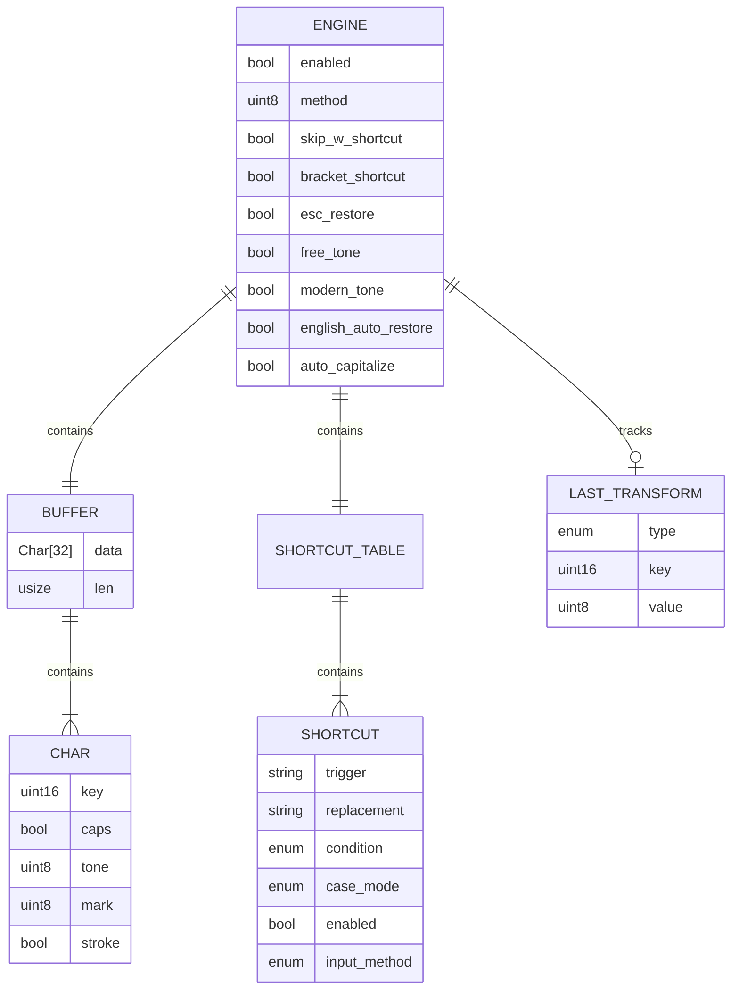

# Data Design

> Auto-generated from codebase analysis.

**Note:** Gõ Nhanh is a stateless input method engine. It does not use traditional databases. This document describes the in-memory data structures and persistent settings storage.

---

## 1. Overview

### 1.1 Data Architecture

```
┌─────────────────────────────────────────────────────────────────┐
│                         Data Layer                              │
├─────────────────────────────────────────────────────────────────┤
│ Runtime (In-Memory)          │ Persistent Storage               │
├──────────────────────────────┼──────────────────────────────────┤
│ • Engine state               │ • UserDefaults (macOS)           │
│ • Circular buffer            │ • Registry (Windows)             │
│ • Shortcut table             │ • Config file (Linux)            │
│ • Transformation history     │ • Per-app mode mappings          │
│ • Vowel lookup tables        │                                  │
└──────────────────────────────┴──────────────────────────────────┘
```

---

## 2. Runtime Data Structures

### 2.1 Entity-Relationship Diagram



### 2.2 Buffer Structure

**Location:** `core/src/engine/buffer.rs`

```rust
pub struct Buffer {
    data: [Char; 32],  // Fixed-size circular buffer
    len: usize,        // Current length
}

pub struct Char {
    pub key: u16,      // Virtual keycode (0-127)
    pub caps: bool,    // Uppercase flag
    pub tone: u8,      // 0=none, 1=circumflex, 2=horn/breve
    pub mark: u8,      // 0=none, 1-5=sắc/huyền/hỏi/ngã/nặng
    pub stroke: bool,  // d → đ flag
}
```

**Memory:** ~200 bytes per engine instance

### 2.3 Syllable Structure

**Location:** `core/src/engine/syllable.rs`

```rust
pub struct Syllable {
    pub initial: Vec<usize>,    // Indices of initial consonant(s)
    pub glide: Option<usize>,   // Index of glide (o/u)
    pub vowel: Vec<usize>,      // Indices of vowel nucleus
    pub final_c: Vec<usize>,    // Indices of final consonant(s)
}
```

### 2.4 Shortcut Structure

**Location:** `core/src/engine/shortcut.rs`

```rust
pub struct Shortcut {
    pub trigger: String,
    pub replacement: String,
    pub condition: TriggerCondition,
    pub case_mode: CaseMode,
    pub enabled: bool,
    pub input_method: InputMethod,
}

pub enum TriggerCondition {
    Immediate,       // Trigger on match
    OnWordBoundary,  // Trigger on space/punctuation
}

pub enum CaseMode {
    Exact,      // Keep replacement as-is
    MatchCase,  // Match trigger case
}

pub enum InputMethod {
    All,    // Both Telex and VNI
    Telex,  // Telex only
    Vni,    // VNI only
}
```

---

## 3. Static Data Tables

### 3.1 Vowel Table

**Location:** `core/src/data/chars.rs`

72 entries: 12 base vowels × 6 variants (base + 5 marks)

```rust
const VOWELS: [(u32, u32, u32, u32, u32, u32); 72] = [
    // (base, sắc, huyền, hỏi, ngã, nặng)
    ('a', 'á', 'à', 'ả', 'ã', 'ạ'),
    ('ă', 'ắ', 'ằ', 'ẳ', 'ẵ', 'ặ'),
    ('â', 'ấ', 'ầ', 'ẩ', 'ẫ', 'ậ'),
    ('e', 'é', 'è', 'ẻ', 'ẽ', 'ẹ'),
    ('ê', 'ế', 'ề', 'ể', 'ễ', 'ệ'),
    ('i', 'í', 'ì', 'ỉ', 'ĩ', 'ị'),
    ('o', 'ó', 'ò', 'ỏ', 'õ', 'ọ'),
    ('ô', 'ố', 'ồ', 'ổ', 'ỗ', 'ộ'),
    ('ơ', 'ớ', 'ờ', 'ở', 'ỡ', 'ợ'),
    ('u', 'ú', 'ù', 'ủ', 'ũ', 'ụ'),
    ('ư', 'ứ', 'ừ', 'ử', 'ữ', 'ự'),
    ('y', 'ý', 'ỳ', 'ỷ', 'ỹ', 'ỵ'),
];
```

### 3.2 Consonant Constants

**Location:** `core/src/data/constants.rs`

| Constant | Count | Values |
|----------|-------|--------|
| VALID_INITIALS_1 | 16 | b, c, d, g, h, k, l, m, n, p, q, r, s, t, v, x |
| VALID_INITIALS_2 | 11 | ch, gh, gi, kh, kr, ng, nh, ph, qu, th, tr |
| VALID_FINALS_1 | 10 | c, k, m, n, p, t, i, y, o, u |
| VALID_FINALS_2 | 3 | ch, ng, nh |

### 3.3 Keycode Mapping

**Location:** `core/src/data/keys.rs`

macOS virtual keycodes (0x00-0x7F):

```rust
pub const A: u16 = 0x00;
pub const S: u16 = 0x01;
pub const D: u16 = 0x02;
// ... etc
```

### 3.4 Valid Vowel Pairs

**Location:** `core/src/data/constants.rs`

```rust
const VALID_VOWEL_PAIRS: [[Base; 2]; 25] = [
    [A, I], [A, O], [A, U], [A, Y],  // ai, ao, au, ay
    [E, I], [E, O], [E, U],          // ei, eo, êu
    [I, A], [I, E], [I, U],          // ia, iê, iu
    [O, A], [O, E], [O, I],          // oa, oe, oi
    [U, A], [U, E], [U, I], [U, O], [U, Y], [U, U],
    [Y, E],
    [A, A], [E, E], [O, O],          // Telex intermediate
];
```

---

## 4. Persistent Storage

### 4.1 macOS (UserDefaults)

**Domain:** `com.gonhanh.app`

| Key | Type | Default | Description |
|-----|------|---------|-------------|
| `enabled` | Bool | true | Engine enabled |
| `method` | Int | 0 | 0=Telex, 1=VNI |
| `perAppMode` | Bool | true | Per-app mode memory |
| `autoWShortcut` | Bool | true | w→ư enabled |
| `bracketShortcut` | Bool | true | ]→ư, [→ơ enabled |
| `escRestore` | Bool | true | ESC restore enabled |
| `freeTone` | Bool | false | Skip validation |
| `modernTone` | Bool | false | Modern placement |
| `englishAutoRestore` | Bool | false | Auto-restore English |
| `autoCapitalize` | Bool | false | Auto-capitalize |
| `soundEnabled` | Bool | true | Toggle sounds |
| `hasCompletedOnboarding` | Bool | false | Onboarding complete |
| `shortcuts` | Array | [] | User shortcuts |

### 4.2 Per-App Mode Storage

**Key Pattern:** `perAppMode_{bundleId}`

```json
{
  "perAppMode_com.microsoft.VSCode": false,
  "perAppMode_com.google.Chrome": true,
  "perAppMode_com.tinyspeck.slackmacgap": true
}
```

### 4.3 Windows (Registry)

**Path:** `HKEY_CURRENT_USER\Software\GoNhanh`

| Key | Type | Default |
|-----|------|---------|
| `Enabled` | DWORD | 1 |
| `Method` | DWORD | 0 |
| `Shortcuts` | REG_SZ | JSON array |

### 4.4 Linux (Config File)

**Path:** `~/.config/fcitx5/conf/gonhanh.conf`

```ini
[General]
Enabled=True
Method=Telex

[Shortcuts]
vn=Việt Nam
hcm=Hồ Chí Minh
```

---

## 5. Data Flow

### 5.1 Keystroke Processing

```
Key Event
    ↓
┌─────────────────────┐
│ Buffer.push(char)   │ → Buffer grows
└─────────────────────┘
    ↓
┌─────────────────────┐
│ Syllable.parse()    │ → Temporary parse result
└─────────────────────┘
    ↓
┌─────────────────────┐
│ Validation.check()  │ → Valid/Invalid
└─────────────────────┘
    ↓
┌─────────────────────┐
│ Transform.apply()   │ → Buffer modified
└─────────────────────┘
    ↓
┌─────────────────────┐
│ Result.build()      │ → FFI Result struct
└─────────────────────┘
```

### 5.2 Shortcut Processing

```
Key Event (space/punctuation)
    ↓
┌─────────────────────┐
│ ShortcutTable.lookup()  │ → Match found?
└─────────────────────┘
    ↓ yes
┌─────────────────────┐
│ Apply case transform    │
└─────────────────────┘
    ↓
┌─────────────────────┐
│ Build Result            │ → backspace + replacement
└─────────────────────┘
```

---

## 6. Memory Usage

| Component | Size | Notes |
|-----------|------|-------|
| Buffer | ~200B | 32 × Char struct |
| Shortcut Table | Variable | ~50B per entry |
| Vowel Table | ~1.7KB | 72 × 6 × u32 |
| Constants | ~500B | Static arrays |
| Engine State | ~100B | Flags and config |
| **Total Runtime** | **~3KB** | Per engine instance |

---

## Changelog

- **2026-01-11**: Initial generation from codebase analysis
